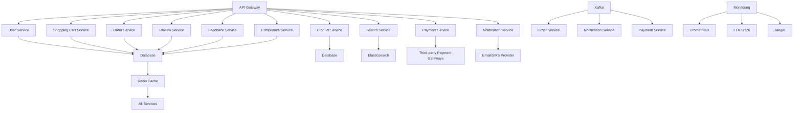

# 系统架构设计说明书  
**版本号：v1.0**  
**创建日期：2025-11-20**  
**作者：AI架构设计助手**

---

## 1. 执行摘要

### 1.1 项目背景和目标

本系统是一个在线购物平台，旨在为用户提供便捷的商品浏览、搜索、购买、支付及售后服务。系统支持多角色（普通用户、商家用户、管理员）操作，并满足高并发、高性能、高可用性等非功能需求。

目标包括：
- 构建一个可扩展、高可用的微服务架构；
- 实现用户身份认证、商品管理、订单处理、支付集成等核心功能；
- 提供良好的用户体验与系统性能；
- 确保数据安全与合规性。

### 1.2 架构设计概述

系统采用**微服务架构**，基于**Spring Boot + React.js**构建前后端分离体系，使用**PostgreSQL + Elasticsearch + Redis**作为主要数据存储方案，通过**Kafka**实现异步通信，部署在**AWS云平台**上。

### 1.3 关键技术决策

| 技术组件 | 决策理由 |
|----------|----------|
| 微服务架构 | 支持独立部署、灵活扩展、故障隔离 |
| Spring Boot | 快速开发、内嵌服务器、易于维护 |
| React.js | 前端组件化、状态管理清晰、提升用户体验 |
| PostgreSQL | 支持复杂查询、事务一致性 |
| Elasticsearch | 高效全文检索、支持大规模数据 |
| Redis | 缓存高频访问数据、提升响应速度 |
| Kafka | 异步通信、解耦服务、保障消息可靠性 |
| JWT + Spring Security | 安全的身份验证机制 |
| AWS | 弹性伸缩、全球CDN加速、高可用基础设施 |

### 1.4 主要风险和建议

| 风险 | 影响 | 建议 |
|------|------|------|
| 微服务间通信复杂 | 可能导致系统稳定性下降 | 引入服务网格（如Istio）或增强服务治理机制 |
| 数据库可能成为瓶颈 | 高并发下响应延迟 | 采用读写分离、分库分表策略 |
| 安全审计日志缺失 | 不利于合规与问题追踪 | 添加安全审计日志记录 |
| 文档不完善 | 影响后续维护与协作 | 完善技术文档并建立代码审查流程 |
| CI/CD流程不健全 | 影响部署效率 | 建立完整的CI/CD流水线 |

---

## 2. 架构概览

### 2.1 系统整体架构图

> **图示说明：**  
> - API Gateway 是统一入口，负责请求路由、鉴权、限流等；
> - 各微服务分别处理不同业务逻辑；
> - Redis 用于缓存高频数据；
> - Kafka 用于异步通信；
> - 监控系统覆盖全栈，确保系统稳定运行。

### 2.2 架构风格和设计原则

- **架构风格：** 微服务架构（Microservices）
- **设计原则：**
  - **单一职责**：每个服务只关注一个业务领域；
  - **松耦合**：服务之间通过接口通信，避免直接依赖；
  - **高可用性**：通过冗余部署、自动恢复机制保障系统稳定性；
  - **可扩展性**：支持水平扩展，适应未来业务增长；
  - **安全性**：采用JWT、RBAC、加密传输等手段保障数据安全；
  - **可观测性**：集成监控、日志、链路追踪等工具，提升系统可维护性。

### 2.3 核心组件和交互关系

| 组件名称 | 功能描述 | 依赖项 |
|----------|----------|--------|
| API Gateway | 请求路由、鉴权、限流 | 所有微服务 |
| User Service | 用户注册、登录、权限管理 | Database, Authentication Service |
| Product Service | 商品信息管理、分类展示 | Database, Search Service |
| Search Service | 商品搜索、筛选 | Elasticsearch, Product Service |
| Shopping Cart Service | 购物车管理 | Database, User Service |
| Order Service | 订单创建、状态跟踪 | Database, Payment Service, Notification Service |
| Payment Service | 支付接口集成 | Third-party Payment Gateways, Order Service |
| Review Service | 用户评价、评论 | Database, User Service |
| Notification Service | 消息通知 | Email/SMS Provider, User Service |
| Cache Service | Redis缓存 | 所有微服务 |
| Message Queue (Kafka) | 异步通信 | Order Service, Notification Service, Payment Service |
| Monitoring Service | 系统监控、日志分析 | Prometheus, ELK Stack, Jaeger |

### 2.4 数据流和控制流

#### 数据流：

- 用户请求 → API Gateway → 微服务 → 数据库 / 外部服务
- 微服务间通信 → Kafka（异步）→ 接收方服务
- 缓存数据 → Redis → 微服务

#### 控制流：

- API Gateway 进行鉴权和路由；
- 微服务处理业务逻辑，调用数据库或外部服务；
- Kafka 用于异步任务处理；
- 监控系统实时收集日志和指标，触发告警。

---

## 3. 技术架构

### 3.1 前端架构设计

- **框架：** React.js + Redux
- **状态管理：** 使用Redux进行全局状态管理，提高组件复用性和可维护性。
- **构建工具：** Webpack
- **UI组件库：** Ant Design 或 Material-UI
- **部署方式：** 静态资源托管于AWS S3 + CloudFront CDN加速
- **跨域处理：** 使用CORS策略，配置允许的来源和方法

### 3.2 后端架构设计

- **框架：** Spring Boot (Java 17)
- **微服务划分：** 每个业务模块独立部署为微服务
- **通信方式：** RESTful API + Kafka（异步）
- **安全机制：** JWT + Spring Security
- **异常处理：** 全局异常处理器，返回标准化错误码和信息
- **日志记录：** SLF4J + Logback，集成ELK Stack

### 3.3 数据库架构设计

- **主数据库：** PostgreSQL（关系型）
- **搜索数据库：** Elasticsearch（全文检索）
- **缓存层：** Redis（会话、热点数据）
- **数据模型：**
  - 用户表（users）
  - 角色表（roles）
  - 权限表（permissions）
  - 用户角色关联表（user_roles）
  - 角色权限关联表（role_permissions）

> **索引策略：** 对常用字段（如`user_id`, `username`, `email`）建立索引，优化查询性能。

### 3.4 缓存架构设计

- **缓存类型：** Redis Cluster
- **缓存策略：**
  - **热点数据缓存：** 如商品详情、用户信息
  - **会话缓存：** 用户登录状态
  - **预加载缓存：** 高频访问数据提前加载
- **缓存失效策略：** 设置TTL（Time to Live），结合LRU算法管理内存

### 3.5 消息队列架构

- **消息中间件：** Apache Kafka
- **使用场景：**
  - 异步处理订单状态更新
  - 发送通知（邮件、短信）
  - 日志异步上传
- **消息格式：** JSON
- **消费模式：** Pull 模式，消费者按需拉取消息
- **容错机制：** 消息重试、死信队列（DLQ）

---

## 4. 部署架构

### 4.1 基础设施架构

- **云平台：** AWS（EC2,

---

**创建日期**: 2025-11-20
**版本**: v1.0